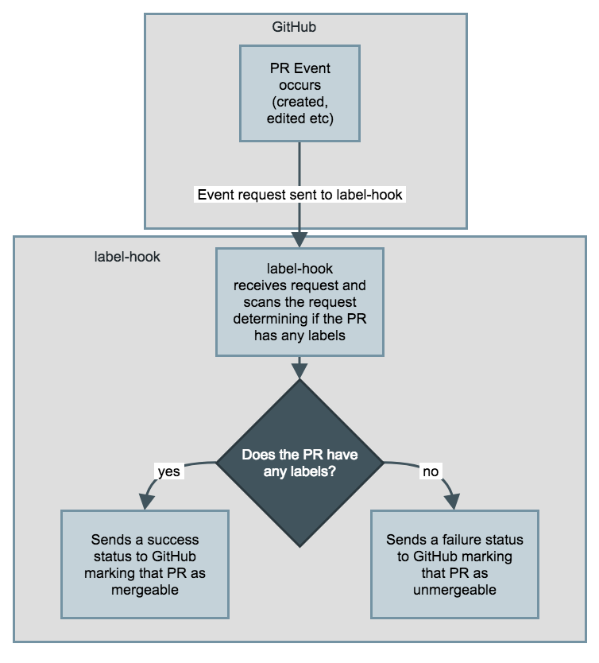

# label-hook 
A simple application that can be used as a GitHub web-hook for ensuring labels are present on pull requests. Written in Go, this application will serve and listen on the user specified host and port where it will perform its function.

## Getting started
### Contributor
As a contributor you will need to fulfil the following requirements:
- Golang installed (version 1.10 or higher)
- Ngrok (for testing webhook using GitHub)
- GitHub personal access token

### User
#### Running label-hook
As a user, the following steps can be followed to ensure the webhook can be used:
- Download the executable file from the release page
- Download the `config.json` template [file](config/config.json) save it in a folder of your choice (it is recommended to keep it in the same folder as the `label-hook` executable to keep it all together) and correctly configure it. Help on what each property in the configuration file means can be found in the config folder [README.md](config/README.md).
- Run the executable providing the path to the config file as an argument. Example `./label-hook config.json`

##### Adding webhook in GitHub
When the label-hook application is running on the desired host and port you have configured, add a GitHub webhook (tutorials around this can be found online by GitHub and others - it is very simple) that uses the URL of the running label-hook and make sure that you specify that ONLY the pull request events get sent to the label-hook and nothing else. This is because it only needs to accept requests coming in that are related to pull requests.

_**NOTE:** label-hook is only the running application itself and you will have to make sure that it is running on a public facing server that GitHub can access in order to send the requests. There are multiple solutions to this, some use [Heruko](https://www.heroku.com/) and some internally host their own public facing server. If you cannot do this, then label-hook cannot be used as there is no way that GitHub can send requests to it._

## How it works?
### Usage flow
Using `Go` and `go-github`, requests are recieved and sent to and from multiple GitHub APIs in order to mark the correct pull requests as mergable.

 
